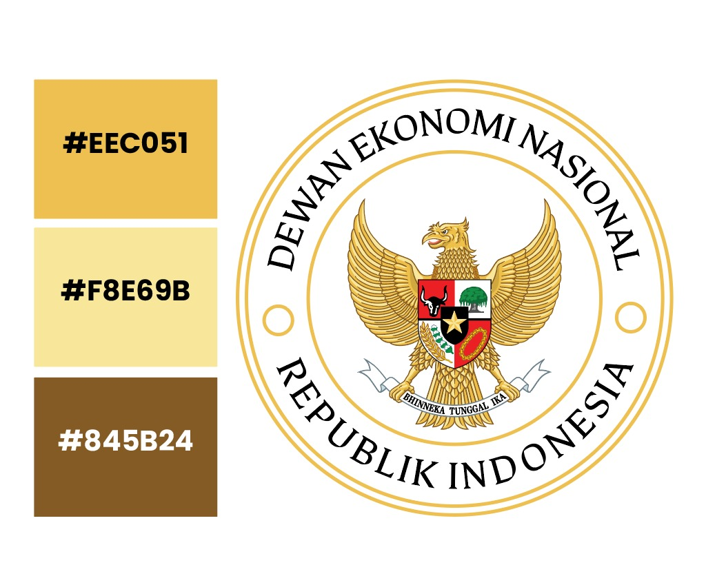
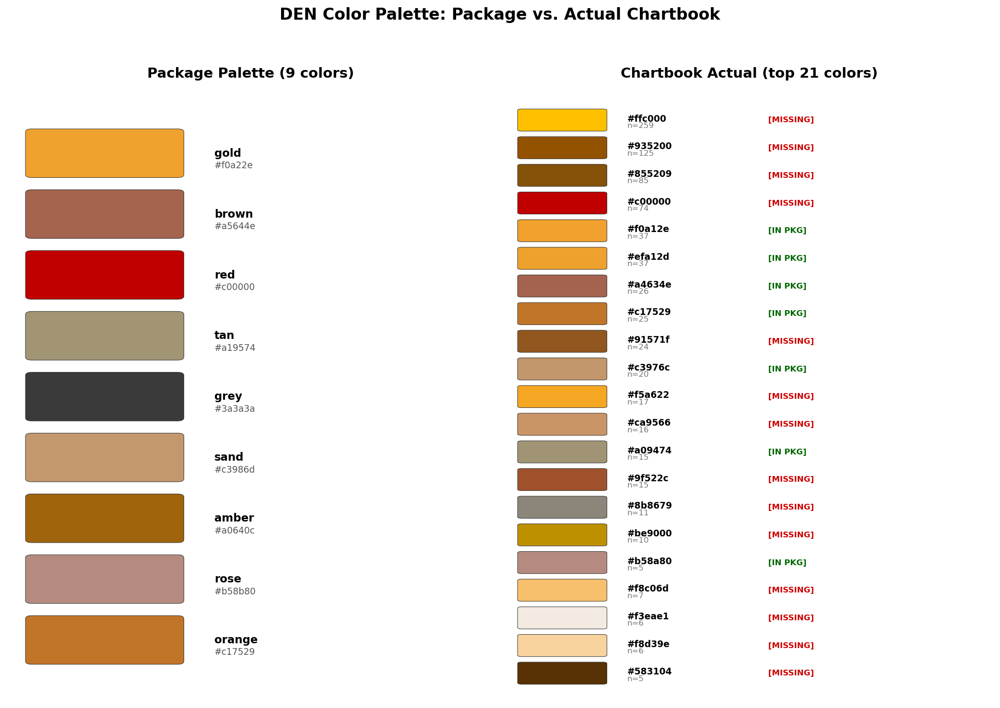
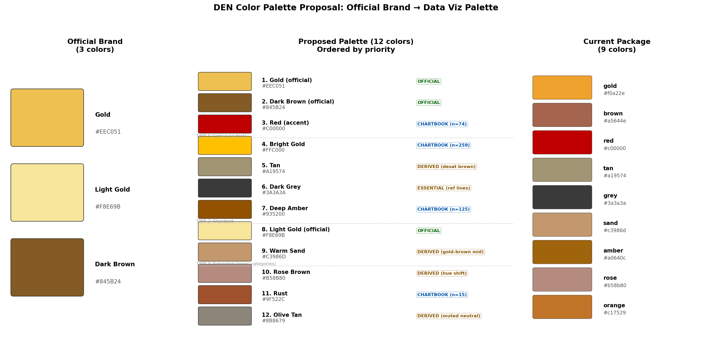
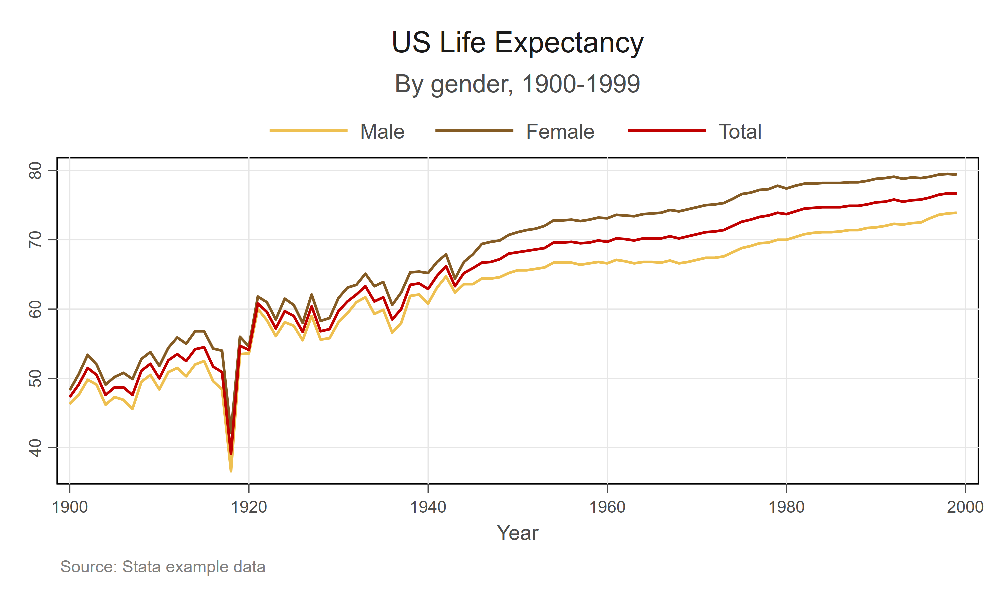
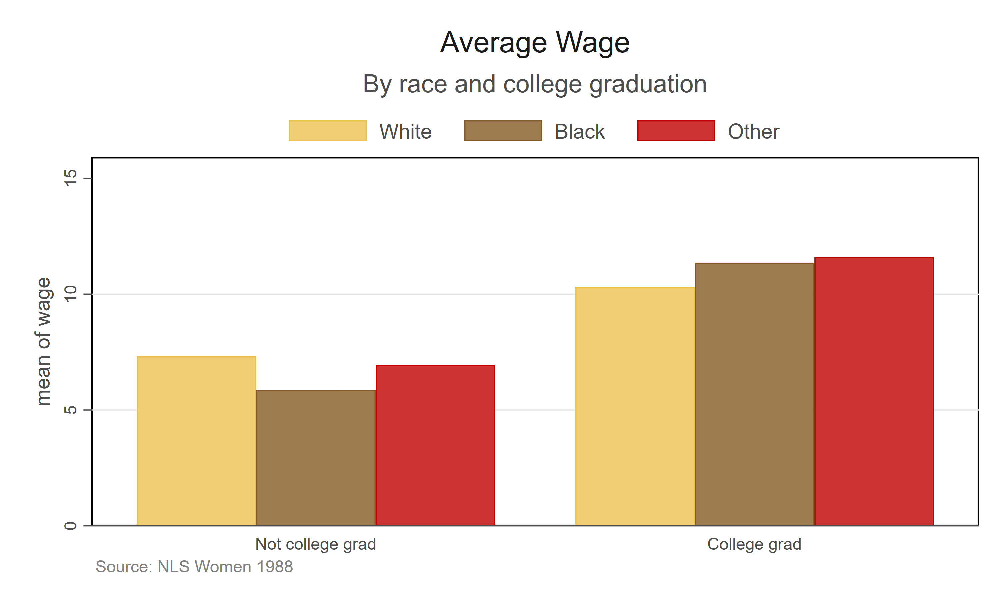
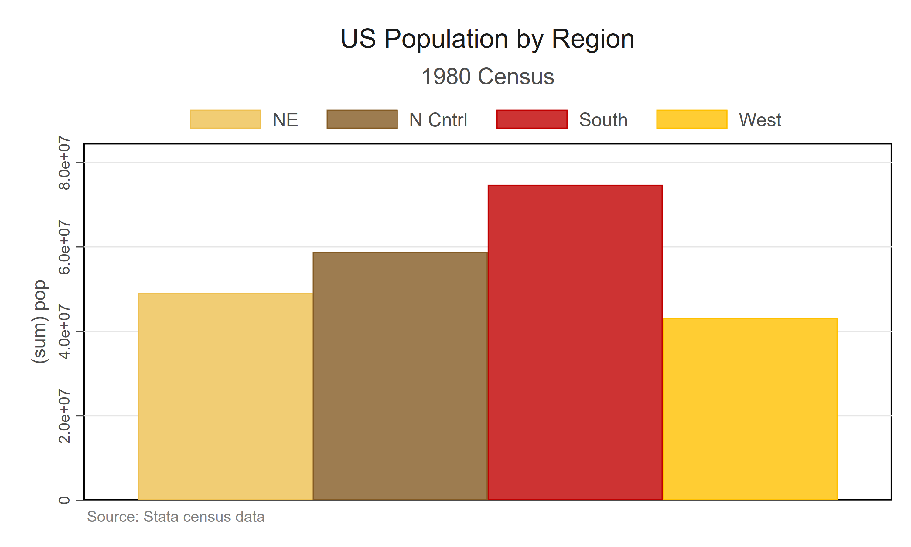
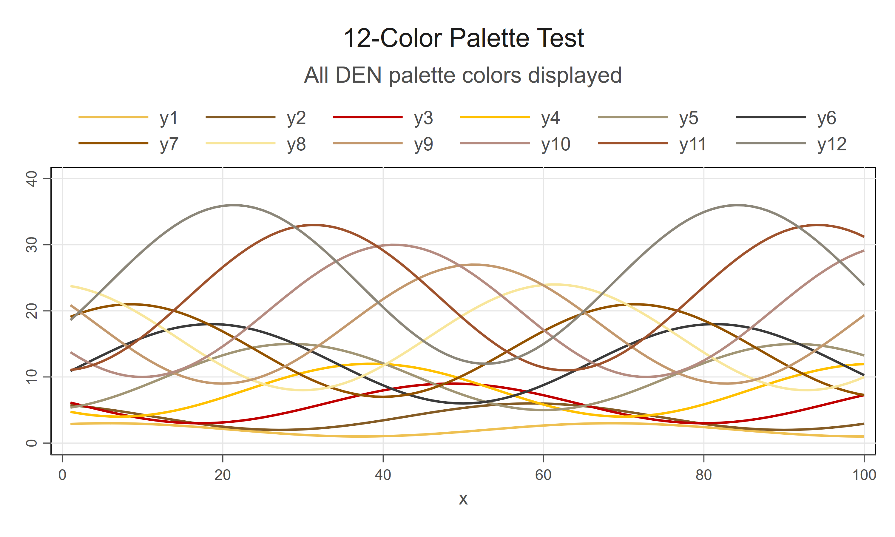
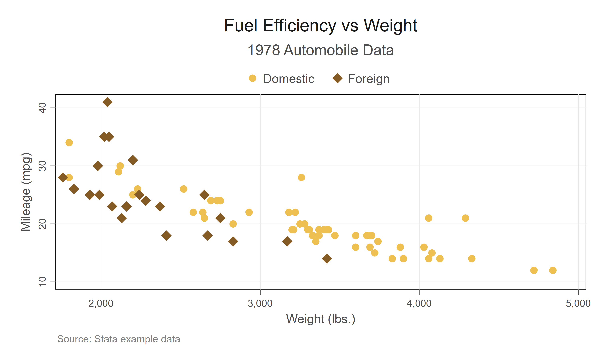
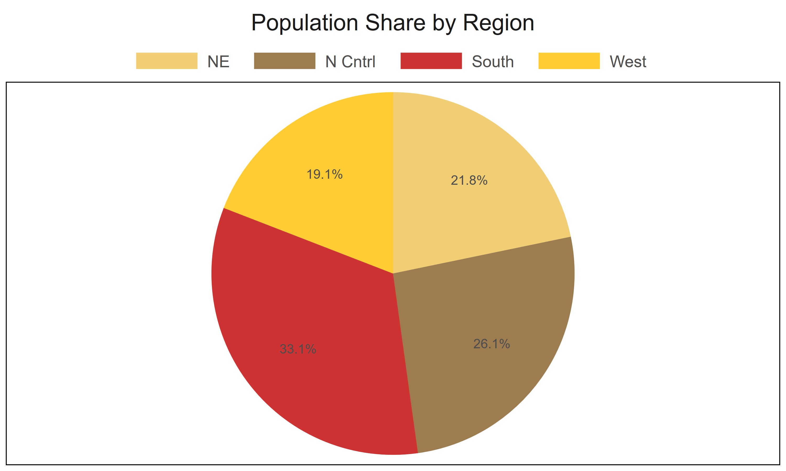

## Pendahuluan

Dokumen ini menetapkan palet warna resmi visualisasi data DEN (Dewan Ekonomi Nasional) versi 1.0. Palet terdiri dari 12 warna kategoris dalam tiga tier, dua *colormap* untuk skala kontinu, serta panduan penggunaan untuk grafik ekonomi.

Palet diimplementasikan dalam tiga paket:

- **fig-den** (Python/matplotlib, v1.0)
- **ggden** (R/ggplot2, v1.0)
- **den-scheme** (Stata, v1.0)

Ketiga paket menggunakan nilai hex identik dalam urutan yang sama.

## Identitas Warna Resmi DEN

Singgih menetapkan identitas warna resmi DEN berupa tiga warna dalam keluarga emas-cokelat (@fig-palette).

{#fig-palette width=50%}

| Nama       | Hex       | Keterangan            |
|------------|-----------|-----------------------|
| Gold       | `#EEC051` | Warna utama brand     |
| Light Gold | `#F8E69B` | Emas muda/pucat       |
| Dark Brown | `#845B24` | Aksen gelap           |

: Tiga warna identitas resmi DEN. {#tbl-official}

Tiga warna ini cukup untuk logo dan kop surat, tetapi **visualisasi data membutuhkan warna yang mudah dibedakan** --- terutama pada grafik dengan 4--8+ kategori. Keluarga emas-cokelat saja tidak dapat memberikan kontras yang memadai untuk grafik multi-seri.

## Prinsip Desain

Palet dirancang dengan prinsip **deviasi minimal dari brand**:

1. Tiga warna resmi menjadi jangkar palet.
2. Warna tambahan diturunkan dari keluarga emas-cokelat (penggelapan, desaturasi, atau pergeseran hue).
3. Satu hue di luar cokelat diperkenalkan: merah (`#C00000`), yang sudah banyak digunakan di chartbook DEN.
4. Setiap warna non-resmi divalidasi terhadap penggunaan aktual chartbook.

### Ekstraksi Warna dari Chartbook

Direktorat Eksekutif Bidang Percepatan Program Prioritas Ekonomi menerbitkan chartbook ekonomi bulanan. Warna diekstrak dari halaman grafik (hlm. 5--28) edisi Maret 2026 menggunakan PyMuPDF.

| Hex       | Jumlah | Keterangan                                |
|-----------|--------|-------------------------------------------|
| `#FFC000` | 259    | Isian batang paling sering                |
| `#935200` | 125    | Cokelat gelap untuk batang/garis          |
| `#855209` | 85     | Varian cokelat gelap                      |
| `#C00000` | 74     | Aksen merah                               |
| `#F0A12E` | 37     | Dekat gold paket lama                     |
| `#A4634E` | 26     | Dekat brown paket lama                    |
| `#C17529` | 25     | Oranye untuk seri tersier                 |
| `#91571F` | 24     | Varian amber gelap                        |

: Warna paling sering digunakan dalam chartbook Maret 2026. {#tbl-extraction}

Temuan utama: gold paket lama (`#F0A22E`) **bukan** gold utama chartbook (`#FFC000`). Gold resmi (`#EEC051`) berada di antara keduanya. Palet v1.0 memperbaiki ini dengan menggunakan warna resmi sebagai warna utama dan warna andalan chartbook sebagai warna sekunder.

{#fig-comparison width=90%}

## Palet 12 Warna

Palet terdiri dari tiga tier: grafik sederhana (2--3 seri) memakai warna paling setia brand, grafik kompleks (8+ seri) memakai set penuh.

{#fig-proposal width=90%}

### Tier 1: Inti (posisi 1--3)

Untuk grafik dengan 1--3 seri data.

| Posisi | Nama       | Hex       | Sumber    | Peran                                   |
|--------|------------|-----------|-----------|------------------------------------------|
| 1      | Gold       | `#EEC051` | Resmi     | Utama: batang/garis pertama              |
| 2      | Dark Brown | `#845B24` | Resmi     | Sekunder: seri kedua                     |
| 3      | Red        | `#C00000` | Chartbook | Aksen: penekanan, nilai negatif          |

: Tier 1, warna inti. {#tbl-tier1}

**Mengapa Red di posisi 3?** Light Gold (`#F8E69B`) terlalu pucat untuk garis dan elemen kecil --- luntur di atas latar putih. Merah memberikan kontras yang dibutuhkan untuk set 3 warna yang fungsional. Warna ini sudah menjadi aksen andalan chartbook (74 penggunaan).

@fig-line mendemonstrasikan set 3 warna inti pada grafik garis.

{#fig-line width=85%}

### Tier 2: Standar (posisi 4--7)

Untuk grafik dengan 4--7 seri.

| Posisi | Nama        | Hex       | Sumber    | Peran                                |
|--------|-------------|-----------|-----------|---------------------------------------|
| 4      | Bright Gold | `#FFC000` | Chartbook | Gold saturasi tinggi, andalan batang |
| 5      | Tan         | `#A19574` | Turunan   | Cokelat desaturasi                   |
| 6      | Dark Grey   | `#3A3A3A` | Esensial  | Garis referensi, baseline, teks      |
| 7      | Deep Amber  | `#935200` | Chartbook | Varian gelap cokelat resmi           |

: Tier 2, warna standar. {#tbl-tier2}

**Mengapa Bright Gold (`#FFC000`) di posisi 4?** Ini warna paling sering digunakan di chartbook (259 kemunculan). Secara visual dekat dengan gold resmi namun lebih saturasi, sehingga dapat dibedakan dalam perbandingan berdampingan.

@fig-bar dan @fig-bar-multi menunjukkan grafik batang menggunakan warna inti dan standar.

{#fig-bar width=85%}

{#fig-bar-multi width=85%}

### Tier 3: Perluasan (posisi 8--12)

Untuk grafik banyak kategori (mitra dagang, rincian sektoral, dsb.).

| Posisi | Nama       | Hex       | Sumber    | Peran                                |
|--------|------------|-----------|-----------|---------------------------------------|
| 8      | Light Gold | `#F8E69B` | Resmi     | Isian area, lapisan batang terterang |
| 9      | Warm Sand  | `#C3986D` | Turunan   | Titik tengah emas-cokelat            |
| 10     | Rose Brown | `#B58B80` | Turunan   | Pergeseran hue untuk variasi         |
| 11     | Rust       | `#9F522C` | Chartbook | Aksen hangat berbeda                 |
| 12     | Olive Tan  | `#8B8679` | Turunan   | Netral redup                         |

: Tier 3, warna perluasan. {#tbl-tier3}

**Mengapa Light Gold (`#F8E69B`) di posisi 8?** Sebagai warna resmi, ia layak ada di palet, tetapi nilainya yang sangat terang membuatnya tidak cocok untuk garis atau batang sempit. Di posisi 8, ia hanya digunakan ketika banyak kategori memerlukannya --- biasanya sebagai isian area atau segmen paling terang dalam batang bertumpuk.

@fig-12colors menunjukkan keseluruhan 12 warna pada grafik garis.

{#fig-12colors width=85%}

### Colormap / Gradien

Untuk skala kontinu (heatmap, choropleth):

- **Sekuensial:** Light Gold (`#F8E69B`) $\rightarrow$ Gold (`#EEC051`) $\rightarrow$ Dark Brown (`#845B24`)
- **Divergen:** Gold (`#EEC051`) $\leftarrow$ Light Gold (`#F8E69B`) $\rightarrow$ Red (`#C00000`)

**Catatan tentang titik tengah divergen:** Light Gold (`#F8E69B`) memiliki bias visual hangat. Pada grafik ekonomi di mana titik tengah memiliki makna semantik tegas (misalnya pertumbuhan nol, neraca perdagangan), pertimbangkan untuk memaksa warna putih pudar (`#F5F5F5`) di titik nol demi akurasi enkoding visual.

## Evaluasi Desain

### Kekuatan

**Set 3 warna inti (Gold, Dark Brown, Red) sangat baik.** Ketiganya memberikan pemisahan yang jelas dan langsung, serta mencakup sebagian besar kebutuhan grafik DEN. Gold menandai identitas DEN, Dark Brown memberikan bobot, dan Red menarik perhatian pada sorotan. Kombinasi ini sangat cocok untuk grafik kebijakan (misalnya Indonesia vs. ASEAN vs. Dunia).

**Identitas brand tidak terbantahkan.** Palet emas-cokelat yang hangat bersifat khas institusional dan Indonesia --- tidak akan tertukar dengan biru Bank Dunia atau abu-abu IMF. Estetika keseluruhan terkesan seperti publikasi khusus (*bespoke*) alih-alih keluaran perangkat lunak standar.

**Untuk grafik 2--4 seri, palet ini sangat kuat.** @fig-bar dan @fig-scatter menunjukkan keluaran yang bersih dan mudah dibaca.

{#fig-scatter width=85%}

### Permasalahan Diversitas Hue pada 5+ Seri

Hampir seluruh 12 warna berada dalam irisan sempit roda warna (kuning $\rightarrow$ oranye $\rightarrow$ merah-cokelat). Palet tidak memiliki **warna dingin sama sekali** --- tidak ada biru, teal, atau hijau. Hal ini menimbulkan dua masalah:

1. **Kepadatan perseptual.** Pada 5+ seri, terutama grafik garis, kelompok cokelat/tan/amber menyatu menjadi kluster yang sulit dibedakan. Posisi 2 (Dark Brown), 5 (Tan), 7 (Deep Amber), 9 (Warm Sand), 11 (Rust), dan 12 (Olive Tan) semuanya dalam keluarga cokelat. @fig-12colors menunjukkan bahwa di luar 4 garis, seri individual menjadi sulit diidentifikasi hanya berdasarkan warna.

2. **Tidak ada pasangan kontras semantik.** Grafik ekonomi sering membutuhkan kontras hangat/dingin yang alami: ekspor vs. impor, surplus vs. defisit, pertumbuhan vs. kontraksi. Palet saat ini memaksa perbedaan ini dibuat dengan "hangat gelap" vs. "hangat terang," yang secara perseptual lebih lemah.

### Tumpang Tindih Saturasi Gold

Posisi 1 (Gold, `#EEC051`), 4 (Bright Gold, `#FFC000`), dan 8 (Light Gold, `#F8E69B`) adalah tiga variasi kuning-emas. Pada @fig-bar-multi, batang NE (pos 1) dan West (pos 4) dapat terbaca sebagai "kategori sama, beda nuansa" pada pandangan pertama. Tiga warna gold dalam palet kategoris 12 warna mengurangi rentang perseptual efektif.

### Visibilitas Light Gold

Posisi 8 (`#F8E69B`) terlalu pucat untuk garis dan penanda kecil pada latar putih. Warna ini berfungsi baik sebagai isian tetapi hampir tidak terlihat sebagai garis, seperti tampak pada @fig-12colors (y8).

### Arah Pengembangan

Untuk potensi v2.0, pertimbangkan untuk mengganti 1--2 warna pada tier Perluasan (posisi 9--12) dengan nada dingin yang lembut. Kandidat:

| Saat ini            | Pengganti yang diusulkan        | Alasan                           |
|---------------------|---------------------------------|-----------------------------------|
| Warm Sand (pos 9)   | Slate Blue (~`#4A6D7C`)        | Jangkar kontras dingin           |
| Olive Tan (pos 12)  | Muted Teal (~`#5B8A72`)        | Keluarga hue kedua               |

Perubahan ini akan memberikan 4 keluarga hue (emas, cokelat, merah, dingin) alih-alih 2 (emas/cokelat, merah), sambil mempertahankan identitas DEN pada tier Inti dan Standar. Karakter institusional yang hangat berasal dari posisi 1--7 --- tier Perluasan sebaiknya mengutamakan keterbacaan.

## Pola Penggunaan yang Direkomendasikan

| Jenis grafik                  | Warna yang digunakan                        |
|-------------------------------|----------------------------------------------|
| 2 seri                        | Gold + Dark Brown (posisi 1--2)              |
| 3 seri                        | Gold + Dark Brown + Red (posisi 1--3)        |
| Kombinasi batang + garis      | Batang: Gold + Bright Gold, Garis: Dark Brown|
| Batang bertumpuk (4--6 kat.)  | Posisi 1, 4, 2, 7 (alternasi terang-gelap)  |
| Banyak kategori (8+)          | Palet 12 warna penuh                         |

: Pola penggunaan yang direkomendasikan. {#tbl-usage}

**Praktik terbaik untuk grafik garis 5+ seri:** Utamakan label langsung di ujung garis (*direct end-of-line labels*) dibanding hanya mengandalkan legenda. Karena palet didominasi nada hangat, warna dalam keluarga cokelat lebih mudah dibedakan ketika dilabeli langsung di samping data alih-alih dicocokkan dengan legenda yang jauh.

{#fig-pie width=70%}

## Perubahan dari v0.1

| Posisi | v0.1               | v1.0                  | Alasan perubahan                            |
|--------|--------------------|-----------------------|----------------------------------------------|
| 1      | `#F0A22E` gold     | `#EEC051` gold        | Diselaraskan dengan warna resmi brand        |
| 2      | `#A5644E` brown    | `#845B24` dark brown  | Diselaraskan dengan warna resmi brand        |
| 3      | `#C00000` red      | `#C00000` red         | Tidak berubah                                |
| 4      | `#A19574` tan      | `#FFC000` bright gold | Warna paling sering chartbook dipromosikan   |
| 5      | `#3A3A3A` grey     | `#A19574` tan         | Digeser; grey dipindah ke posisi 6           |
| 6      | `#C3986D` sand     | `#3A3A3A` dark grey   | Netral esensial dipertahankan                |
| 7      | `#A0640C` amber    | `#935200` deep amber  | Diganti dengan warna tervalidasi chartbook   |
| 8      | `#B58B80` rose     | `#F8E69B` light gold  | Warna resmi ditambahkan (sebelumnya absen)   |
| 9      | `#C17529` orange   | `#C3986D` warm sand   | Oranye dibuang (terlalu mirip gold)          |
| 10     | ---                | `#B58B80` rose brown  | Diperluas dari 9 ke 12 warna                |
| 11     | ---                | `#9F522C` rust        | Penambahan tervalidasi chartbook             |
| 12     | ---                | `#8B8679` olive tan   | Netral redup untuk set kategori besar        |

: Perubahan palet dari v0.1 ke v1.0. {#tbl-changes}

**Warna yang dihapus:**

- `#A0640C` (amber lama): terlalu mirip Deep Amber baru dan Dark Brown resmi.
- `#C17529` (oranye lama): terlalu mirip Bright Gold dan Gold baru.

## Keterbatasan

- **Kluster hue:** Palet didominasi nada hangat (kuning--cokelat--merah). Untuk grafik 5+ seri, warna keluarga cokelat mungkin sulit dibedakan. Gunakan label langsung dan pertimbangkan *pattern fill* untuk membantu keterbacaan.
- **Aksesibilitas buta warna:** Pasangan Gold/Bright Gold dan Brown/Amber mungkin sulit dibedakan bagi penderita deuteranopia. Gunakan *pattern fill* atau label langsung untuk publikasi yang memerlukan aksesibilitas tinggi.
- **Batas 12 warna:** Grafik dengan 12+ kategori akan mendaur ulang warna. Kelompokkan kategori kecil ke "Lainnya" atau gunakan panel terfaset.
- **Light Gold di atas putih:** `#F8E69B` kontras rendah terhadap latar putih. Cocok untuk area terisi, tidak untuk garis atau penanda kecil.

## Paket

| Paket      | Bahasa   | Versi | Repositori |
|------------|----------|-------|------------|
| fig-den    | Python   | v1.0  | [github.com/den-econ/fig-den](https://github.com/den-econ/fig-den) |
| ggden      | R        | v1.0  | [github.com/den-econ/ggden](https://github.com/den-econ/ggden) |
| den-scheme | Stata    | v1.0  | [github.com/den-econ/den-scheme](https://github.com/den-econ/den-scheme) |

: Paket visualisasi DEN. {#tbl-packages}

Seluruh paket menggunakan nilai hex identik dalam urutan yang sama.
